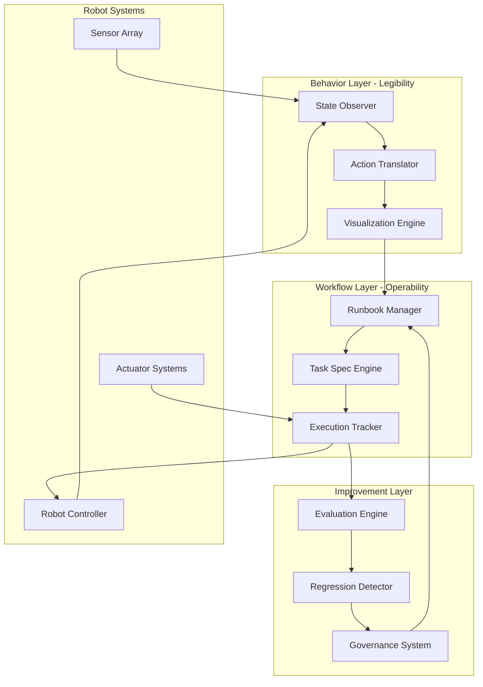
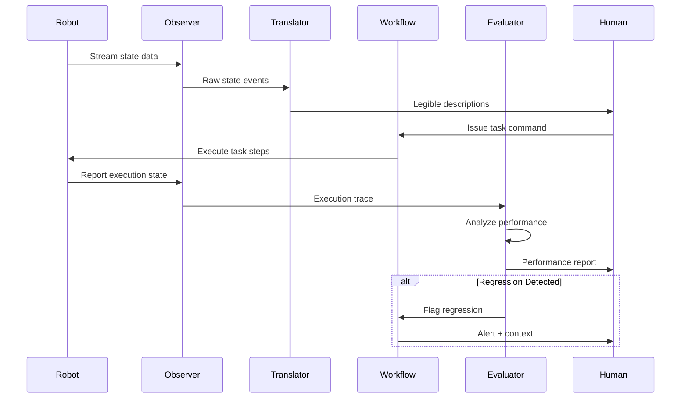

# Design Document: StepbyStep:ROBOTICS

## Overview

StepbyStep:ROBOTICS is a comprehensive observability and translation system that makes robots legible, operable, and improvable. The system operates across three interconnected layers: the Behavior Layer provides real-time legibility through state observation and action translation; the Workflow Layer enables operability through runbooks, task specifications, and execution tracking; and the Improvement Layer facilitates continuous enhancement through evaluation, regression detection, and governance. This architecture creates a unified standard for robotics observability, enabling humans to understand what robots are doing, operators to control and guide robot behavior, and teams to systematically improve robot performance over time.

## Architecture



## Main Workflow Sequence



## Components and Interfaces

### Component 1: State Observer

**Purpose**: Captures and normalizes robot state data from multiple sources in real-time

**Interface**:
```pascal
INTERFACE StateObserver
  PROCEDURE observeState(robotId: UUID): StateStream
  PROCEDURE captureSnapshot(robotId: UUID): RobotState
  PROCEDURE subscribeToEvents(robotId: UUID, eventTypes: EventTypeSet): EventStream
  PROCEDURE getStateHistory(robotId: UUID, timeRange: TimeRange): StateHistory
END INTERFACE
```

**Responsibilities**:
- Monitor robot sensors, actuators, and internal state continuously
- Normalize heterogeneous data formats into unified state representation
- Buffer and stream state data with configurable sampling rates
- Maintain historical state records for analysis and replay


### Component 2: Action Translator

**Purpose**: Converts low-level robot actions into human-readable descriptions and vice versa

**Interface**:
```pascal
INTERFACE ActionTranslator
  PROCEDURE translateToHuman(action: RobotAction): HumanReadableDescription
  PROCEDURE translateToRobot(description: HumanCommand): RobotActionSequence
  PROCEDURE explainBehavior(stateSequence: StateHistory): BehaviorNarrative
  PROCEDURE validateTranslation(original: RobotAction, translated: HumanReadableDescription): ValidationResult
END INTERFACE
```

**Responsibilities**:
- Map low-level motor commands to high-level action descriptions
- Parse natural language commands into executable robot instructions
- Generate contextual explanations of robot behavior sequences
- Ensure bidirectional translation accuracy and consistency

### Component 3: Runbook Manager

**Purpose**: Manages operational procedures and task specifications for robot operations

**Interface**:
```pascal
INTERFACE RunbookManager
  PROCEDURE createRunbook(name: String, steps: StepSequence): RunbookId
  PROCEDURE getRunbook(id: RunbookId): Runbook
  PROCEDURE executeRunbook(id: RunbookId, robotId: UUID, params: Parameters): ExecutionId
  PROCEDURE updateRunbook(id: RunbookId, updates: RunbookUpdates): Result
  PROCEDURE validateRunbook(runbook: Runbook): ValidationReport
END INTERFACE
```

**Responsibilities**:
- Store and version control operational runbooks
- Validate runbook structure and dependencies
- Coordinate runbook execution with task specifications
- Track runbook usage patterns and success rates


### Component 4: Task Spec Engine

**Purpose**: Defines, validates, and manages task specifications with formal constraints

**Interface**:
```pascal
INTERFACE TaskSpecEngine
  PROCEDURE defineTask(spec: TaskSpecification): TaskId
  PROCEDURE validateSpec(spec: TaskSpecification): ValidationResult
  PROCEDURE decomposeTask(taskId: TaskId): SubTaskSequence
  PROCEDURE checkPreconditions(taskId: TaskId, currentState: RobotState): Boolean
  PROCEDURE verifyPostconditions(taskId: TaskId, resultState: RobotState): Boolean
END INTERFACE
```

**Responsibilities**:
- Define task specifications with preconditions and postconditions
- Decompose complex tasks into executable subtasks
- Validate task feasibility given robot capabilities
- Verify task completion against success criteria

### Component 5: Execution Tracker

**Purpose**: Monitors task execution in real-time and maintains execution history

**Interface**:
```pascal
INTERFACE ExecutionTracker
  PROCEDURE startTracking(executionId: ExecutionId): TrackingSession
  PROCEDURE recordStep(executionId: ExecutionId, step: ExecutionStep): Result
  PROCEDURE getCurrentStatus(executionId: ExecutionId): ExecutionStatus
  PROCEDURE getExecutionTrace(executionId: ExecutionId): ExecutionTrace
  PROCEDURE detectAnomaly(executionId: ExecutionId): AnomalyReport
END INTERFACE
```

**Responsibilities**:
- Track task execution progress step-by-step
- Record timing, state changes, and outcomes for each step
- Detect execution anomalies and deviations from expected behavior
- Provide real-time execution visibility to operators


### Component 6: Evaluation Engine

**Purpose**: Analyzes robot performance and identifies improvement opportunities

**Interface**:
```pascal
INTERFACE EvaluationEngine
  PROCEDURE evaluateExecution(trace: ExecutionTrace): PerformanceMetrics
  PROCEDURE compareExecutions(traceA: ExecutionTrace, traceB: ExecutionTrace): ComparisonReport
  PROCEDURE identifyBottlenecks(trace: ExecutionTrace): BottleneckList
  PROCEDURE generateRecommendations(metrics: PerformanceMetrics): RecommendationList
END INTERFACE
```

**Responsibilities**:
- Compute performance metrics from execution traces
- Compare executions to identify performance variations
- Detect bottlenecks and inefficiencies in robot behavior
- Generate actionable improvement recommendations

### Component 7: Regression Detector

**Purpose**: Identifies performance regressions and behavioral anomalies

**Interface**:
```pascal
INTERFACE RegressionDetector
  PROCEDURE establishBaseline(taskId: TaskId, traces: ExecutionTraceSet): Baseline
  PROCEDURE detectRegression(taskId: TaskId, newTrace: ExecutionTrace): RegressionReport
  PROCEDURE classifyRegression(report: RegressionReport): RegressionSeverity
  PROCEDURE trackRegressionHistory(taskId: TaskId): RegressionTimeline
END INTERFACE
```

**Responsibilities**:
- Establish performance baselines from historical data
- Detect statistically significant performance degradations
- Classify regression severity and impact
- Track regression trends over time

### Component 8: Governance System

**Purpose**: Enforces policies, manages approvals, and maintains audit trails

**Interface**:
```pascal
INTERFACE GovernanceSystem
  PROCEDURE enforcePolicy(action: ProposedAction): PolicyDecision
  PROCEDURE requestApproval(change: ProposedChange): ApprovalRequest
  PROCEDURE auditAction(action: ExecutedAction): AuditEntry
  PROCEDURE generateComplianceReport(timeRange: TimeRange): ComplianceReport
END INTERFACE
```

**Responsibilities**:
- Enforce safety and operational policies
- Manage approval workflows for critical changes
- Maintain comprehensive audit trails
- Generate compliance and governance reports


## Data Models

### Model 1: RobotState

```pascal
STRUCTURE RobotState
  robotId: UUID
  timestamp: Timestamp
  position: Vector3D
  orientation: Quaternion
  jointStates: Map<JointId, JointState>
  sensorReadings: Map<SensorId, SensorValue>
  actuatorStates: Map<ActuatorId, ActuatorState>
  batteryLevel: Float
  errorFlags: Set<ErrorCode>
  metadata: Map<String, Value>
END STRUCTURE

STRUCTURE JointState
  jointId: JointId
  angle: Float
  velocity: Float
  torque: Float
  temperature: Float
END STRUCTURE
```

**Validation Rules**:
- robotId must be valid and registered in system
- timestamp must be monotonically increasing for same robot
- position and orientation must be within physical workspace bounds
- batteryLevel must be between 0.0 and 1.0
- All sensor readings must be within calibrated ranges

### Model 2: TaskSpecification

```pascal
STRUCTURE TaskSpecification
  taskId: TaskId
  name: String
  description: String
  preconditions: Set<Condition>
  postconditions: Set<Condition>
  steps: Sequence<TaskStep>
  timeoutSeconds: Integer
  requiredCapabilities: Set<Capability>
  safetyConstraints: Set<SafetyConstraint>
END STRUCTURE

STRUCTURE TaskStep
  stepId: StepId
  action: ActionType
  parameters: Map<String, Value>
  expectedDuration: Duration
  successCriteria: Set<Criterion>
  failureHandling: FailureStrategy
END STRUCTURE

STRUCTURE Condition
  type: ConditionType
  expression: LogicalExpression
  tolerance: Float
END STRUCTURE
```

**Validation Rules**:
- taskId must be unique within system
- name must be non-empty and follow naming conventions
- preconditions must be verifiable from RobotState
- postconditions must be measurable and deterministic
- steps must form valid execution sequence without circular dependencies
- timeoutSeconds must be positive
- All referenced capabilities must exist in robot capability registry


### Model 3: ExecutionTrace

```pascal
STRUCTURE ExecutionTrace
  executionId: ExecutionId
  taskId: TaskId
  robotId: UUID
  startTime: Timestamp
  endTime: Timestamp
  status: ExecutionStatus
  steps: Sequence<ExecutionStepRecord>
  stateHistory: Sequence<RobotState>
  anomalies: Sequence<Anomaly>
  performanceMetrics: PerformanceMetrics
END STRUCTURE

STRUCTURE ExecutionStepRecord
  stepId: StepId
  startTime: Timestamp
  endTime: Timestamp
  status: StepStatus
  inputState: RobotState
  outputState: RobotState
  actualDuration: Duration
  deviations: Sequence<Deviation>
END STRUCTURE

ENUMERATION ExecutionStatus
  PENDING
  IN_PROGRESS
  COMPLETED
  FAILED
  ABORTED
  TIMEOUT
END ENUMERATION
```

**Validation Rules**:
- executionId must be unique and immutable
- endTime must be greater than or equal to startTime
- steps must be ordered chronologically
- stateHistory must contain at least initial and final states
- Each step's endTime must match next step's startTime (or have valid gap)
- status must transition according to valid state machine

### Model 4: PerformanceMetrics

```pascal
STRUCTURE PerformanceMetrics
  executionId: ExecutionId
  totalDuration: Duration
  successRate: Float
  energyConsumed: Float
  accuracyScore: Float
  smoothnessScore: Float
  safetyScore: Float
  stepMetrics: Map<StepId, StepMetrics>
  aggregateStats: StatisticalSummary
END STRUCTURE

STRUCTURE StepMetrics
  stepId: StepId
  duration: Duration
  retryCount: Integer
  errorRate: Float
  resourceUsage: ResourceUsage
END STRUCTURE
```

**Validation Rules**:
- All score values must be between 0.0 and 1.0
- totalDuration must equal sum of step durations plus gaps
- successRate must reflect actual completion status
- energyConsumed must be non-negative
- stepMetrics must exist for all executed steps


## Key Functions with Formal Specifications

### Function 1: observeAndTranslate()

```pascal
FUNCTION observeAndTranslate(robotId: UUID, duration: Duration): NarrativeStream
```

**Preconditions:**
- robotId is valid and robot is registered in system
- Robot is powered on and responsive
- duration is positive value
- State observer is initialized and connected to robot

**Postconditions:**
- Returns stream of human-readable narratives describing robot behavior
- Each narrative corresponds to observable state change or action
- Stream continues for specified duration or until explicitly stopped
- No state observations are lost or duplicated
- Translation accuracy meets minimum threshold (>95%)

**Loop Invariants:** N/A (streaming function)

### Function 2: executeTaskWithTracking()

```pascal
FUNCTION executeTaskWithTracking(taskId: TaskId, robotId: UUID, params: Parameters): ExecutionTrace
```

**Preconditions:**
- taskId references valid, validated task specification
- robotId is valid and robot is operational
- params contains all required parameters for task
- Task preconditions are satisfied in current robot state
- Robot has all required capabilities for task
- No conflicting tasks are currently executing on robot

**Postconditions:**
- Returns complete execution trace with all steps recorded
- Robot state satisfies task postconditions if status is COMPLETED
- All state transitions are captured in stateHistory
- Execution trace is persisted to storage
- If execution fails, robot is in safe state
- Performance metrics are computed and attached to trace

**Loop Invariants:**
- For each step execution: All previous steps are recorded in trace
- Robot state remains within safety constraints throughout execution
- Execution time does not exceed task timeout


### Function 3: detectAndClassifyRegression()

```pascal
FUNCTION detectAndClassifyRegression(taskId: TaskId, newTrace: ExecutionTrace, baseline: Baseline): RegressionReport
```

**Preconditions:**
- taskId is valid and matches both newTrace and baseline
- newTrace is complete with status COMPLETED or FAILED
- baseline contains sufficient historical data (minimum 10 executions)
- baseline statistics are up-to-date and valid
- Performance metrics are computed for newTrace

**Postconditions:**
- Returns regression report with detection result (regression detected or not)
- If regression detected, report includes severity classification
- Report contains statistical evidence (p-value, effect size)
- Report identifies specific metrics that regressed
- Report includes comparison to baseline statistics
- Detection uses consistent statistical threshold (p < 0.05)

**Loop Invariants:**
- For each metric comparison: Statistical validity is maintained
- Baseline data remains unchanged during analysis

### Function 4: validateAndEnforcePolicy()

```pascal
FUNCTION validateAndEnforcePolicy(action: ProposedAction, context: ExecutionContext): PolicyDecision
```

**Preconditions:**
- action is well-formed and contains all required fields
- context includes current robot state and environment conditions
- All relevant policies are loaded and active
- Policy rules are consistent (no contradictions)

**Postconditions:**
- Returns ALLOW, DENY, or REQUIRE_APPROVAL decision
- If DENY, includes list of violated policies with explanations
- If REQUIRE_APPROVAL, includes approval workflow details
- Decision is deterministic given same action and context
- Audit entry is created for decision
- Decision respects policy priority ordering

**Loop Invariants:**
- For each policy evaluation: Higher priority policies are checked first
- Policy evaluation state remains consistent


## Algorithmic Pseudocode

### Main Processing Algorithm: Task Execution Pipeline

```pascal
ALGORITHM executeTaskPipeline(taskId, robotId, params)
INPUT: taskId of type TaskId, robotId of type UUID, params of type Parameters
OUTPUT: trace of type ExecutionTrace

BEGIN
  ASSERT taskExists(taskId) AND robotIsOperational(robotId)
  
  // Step 1: Load and validate task specification
  taskSpec ← loadTaskSpecification(taskId)
  validationResult ← validateTaskSpec(taskSpec)
  IF NOT validationResult.isValid THEN
    RETURN createFailureTrace(taskId, robotId, "Invalid task specification")
  END IF
  
  // Step 2: Check preconditions
  currentState ← captureRobotState(robotId)
  IF NOT checkPreconditions(taskSpec, currentState) THEN
    RETURN createFailureTrace(taskId, robotId, "Preconditions not satisfied")
  END IF
  
  // Step 3: Initialize execution tracking
  executionId ← generateExecutionId()
  trace ← initializeTrace(executionId, taskId, robotId)
  trackingSession ← startTracking(executionId)
  
  // Step 4: Execute task steps with loop invariant
  FOR each step IN taskSpec.steps DO
    ASSERT allPreviousStepsRecorded(trace) AND robotInSafeState(robotId)
    
    stepStartTime ← getCurrentTime()
    stepStartState ← captureRobotState(robotId)
    
    // Execute step with timeout protection
    stepResult ← executeStepWithTimeout(step, robotId, params, step.timeoutSeconds)
    
    stepEndTime ← getCurrentTime()
    stepEndState ← captureRobotState(robotId)
    
    // Record step execution
    stepRecord ← createStepRecord(step.stepId, stepStartTime, stepEndTime, 
                                   stepStartState, stepEndState, stepResult)
    trace.steps.append(stepRecord)
    
    // Check for step failure
    IF stepResult.status = FAILED THEN
      handleStepFailure(step, stepResult, trace)
      IF step.failureHandling = ABORT THEN
        trace.status ← FAILED
        RETURN finalizeTrace(trace)
      END IF
    END IF
    
    ASSERT stepIsRecorded(trace, step.stepId)
  END FOR
  
  // Step 5: Verify postconditions
  finalState ← captureRobotState(robotId)
  IF checkPostconditions(taskSpec, finalState) THEN
    trace.status ← COMPLETED
  ELSE
    trace.status ← FAILED
    trace.anomalies.append(createAnomaly("Postconditions not satisfied"))
  END IF
  
  // Step 6: Compute performance metrics
  trace.performanceMetrics ← computeMetrics(trace)
  
  // Step 7: Persist and return
  persistTrace(trace)
  stopTracking(trackingSession)
  
  ASSERT trace.status IN {COMPLETED, FAILED} AND traceIsComplete(trace)
  
  RETURN trace
END
```

**Preconditions:**
- taskId references valid task specification
- robotId is operational and responsive
- params contains all required parameters
- System has sufficient resources for execution

**Postconditions:**
- Returns complete execution trace
- All steps are recorded in trace
- Robot is in safe state
- Trace is persisted to storage
- Tracking session is properly closed

**Loop Invariants:**
- All previous steps are recorded in trace
- Robot remains in safe state
- Execution time within bounds
- Trace consistency maintained


### State Observation and Translation Algorithm

```pascal
ALGORITHM observeAndTranslateStream(robotId, duration)
INPUT: robotId of type UUID, duration of type Duration
OUTPUT: narrativeStream of type NarrativeStream

BEGIN
  ASSERT robotIsRegistered(robotId) AND duration > 0
  
  // Initialize observation
  observer ← getStateObserver()
  translator ← getActionTranslator()
  stateStream ← observer.observeState(robotId)
  narrativeStream ← createNarrativeStream()
  
  startTime ← getCurrentTime()
  previousState ← NULL
  stateBuffer ← createBuffer()
  
  // Stream processing loop
  WHILE (getCurrentTime() - startTime) < duration DO
    ASSERT streamIsActive(stateStream) AND translatorIsResponsive(translator)
    
    // Read next state with timeout
    currentState ← stateStream.readNext(timeout: 100ms)
    
    IF currentState = NULL THEN
      CONTINUE  // Timeout, retry
    END IF
    
    stateBuffer.append(currentState)
    
    // Detect significant state changes
    IF previousState ≠ NULL THEN
      changes ← detectSignificantChanges(previousState, currentState)
      
      IF changes.isNotEmpty() THEN
        // Translate changes to human narrative
        FOR each change IN changes DO
          action ← inferAction(change, stateBuffer)
          narrative ← translator.translateToHuman(action)
          
          // Validate translation quality
          validation ← translator.validateTranslation(action, narrative)
          IF validation.accuracy >= 0.95 THEN
            narrativeStream.emit(narrative)
          ELSE
            narrativeStream.emit(createLowConfidenceNarrative(action, validation))
          END IF
        END FOR
      END IF
    END IF
    
    previousState ← currentState
    
    // Maintain buffer size
    IF stateBuffer.size() > MAX_BUFFER_SIZE THEN
      stateBuffer.removeOldest()
    END IF
    
    ASSERT stateBuffer.size() <= MAX_BUFFER_SIZE
  END WHILE
  
  narrativeStream.close()
  
  ASSERT narrativeStream.isClosed()
  
  RETURN narrativeStream
END
```

**Preconditions:**
- robotId is valid and robot is operational
- duration is positive
- State observer and translator are initialized

**Postconditions:**
- Returns stream of human-readable narratives
- Stream duration matches requested duration
- All significant state changes are translated
- Translation accuracy meets threshold
- Stream is properly closed

**Loop Invariants:**
- Stream remains active throughout duration
- State buffer size never exceeds maximum
- All emitted narratives meet accuracy threshold
- Previous state is always defined after first iteration


### Regression Detection Algorithm

```pascal
ALGORITHM detectRegression(taskId, newTrace, baseline)
INPUT: taskId of type TaskId, newTrace of type ExecutionTrace, baseline of type Baseline
OUTPUT: report of type RegressionReport

BEGIN
  ASSERT taskId = newTrace.taskId = baseline.taskId
  ASSERT newTrace.status IN {COMPLETED, FAILED}
  ASSERT baseline.sampleSize >= 10
  
  report ← createRegressionReport(taskId, newTrace.executionId)
  regressionDetected ← FALSE
  
  // Extract metrics from new trace
  newMetrics ← newTrace.performanceMetrics
  
  // Compare each metric against baseline
  FOR each metricName IN baseline.metrics.keys() DO
    ASSERT baseline.metrics[metricName].isValid()
    
    baselineStats ← baseline.metrics[metricName]
    newValue ← newMetrics.get(metricName)
    
    // Perform statistical test (two-sample t-test)
    testResult ← performTTest(newValue, baselineStats.mean, 
                               baselineStats.stdDev, baselineStats.sampleSize)
    
    // Check for significant degradation
    IF testResult.pValue < 0.05 AND testResult.effectSize > 0.5 THEN
      degradation ← calculateDegradation(newValue, baselineStats.mean)
      
      IF degradation > 0.1 THEN  // 10% threshold
        regressionDetected ← TRUE
        
        regressionDetail ← createRegressionDetail(
          metricName: metricName,
          baselineValue: baselineStats.mean,
          newValue: newValue,
          degradation: degradation,
          pValue: testResult.pValue,
          effectSize: testResult.effectSize
        )
        
        report.regressions.append(regressionDetail)
      END IF
    END IF
  END FOR
  
  // Classify overall severity
  IF regressionDetected THEN
    report.detected ← TRUE
    report.severity ← classifySeverity(report.regressions)
    report.recommendation ← generateRecommendation(report.regressions)
  ELSE
    report.detected ← FALSE
    report.severity ← NONE
  END IF
  
  report.timestamp ← getCurrentTime()
  
  ASSERT report.detected = regressionDetected
  ASSERT report.detected IMPLIES report.regressions.isNotEmpty()
  
  RETURN report
END
```

**Preconditions:**
- taskId matches both newTrace and baseline
- newTrace is complete execution
- baseline has sufficient sample size (≥10)
- baseline statistics are valid and up-to-date
- Performance metrics are computed for newTrace

**Postconditions:**
- Returns complete regression report
- report.detected is true if and only if regressions found
- All detected regressions have statistical evidence
- Severity classification is consistent with regression details
- Report includes actionable recommendations if regressions detected

**Loop Invariants:**
- For each metric: Statistical test is performed correctly
- Baseline statistics remain unchanged
- Regression detection threshold is consistent (p < 0.05, effect size > 0.5)


### Policy Enforcement Algorithm

```pascal
ALGORITHM enforcePolicy(action, context)
INPUT: action of type ProposedAction, context of type ExecutionContext
OUTPUT: decision of type PolicyDecision

BEGIN
  ASSERT action.isWellFormed() AND context.isValid()
  ASSERT allPoliciesLoaded() AND policiesAreConsistent()
  
  decision ← createPolicyDecision(action.id)
  policies ← loadActivePolicies()
  sortPoliciesByPriority(policies)  // Highest priority first
  
  violatedPolicies ← createEmptyList()
  requiresApproval ← FALSE
  
  // Evaluate policies in priority order
  FOR each policy IN policies DO
    ASSERT policy.priority >= 0
    ASSERT allHigherPriorityPoliciesEvaluated(policy, policies)
    
    evaluationResult ← evaluatePolicy(policy, action, context)
    
    IF evaluationResult.result = DENY THEN
      violatedPolicies.append(createViolation(
        policyId: policy.id,
        policyName: policy.name,
        reason: evaluationResult.reason,
        severity: policy.severity
      ))
      
      // Critical policy violation - immediate deny
      IF policy.severity = CRITICAL THEN
        decision.result ← DENY
        decision.violations ← violatedPolicies
        decision.explanation ← "Critical policy violation: " + policy.name
        
        auditPolicyDecision(decision, action, context)
        
        ASSERT decision.result = DENY
        RETURN decision
      END IF
      
    ELSE IF evaluationResult.result = REQUIRE_APPROVAL THEN
      requiresApproval ← TRUE
      decision.approvalWorkflow ← policy.approvalWorkflow
    END IF
  END FOR
  
  // Determine final decision
  IF violatedPolicies.isNotEmpty() THEN
    decision.result ← DENY
    decision.violations ← violatedPolicies
    decision.explanation ← generateViolationSummary(violatedPolicies)
  ELSE IF requiresApproval THEN
    decision.result ← REQUIRE_APPROVAL
    decision.explanation ← "Action requires approval per policy"
  ELSE
    decision.result ← ALLOW
    decision.explanation ← "Action complies with all policies"
  END IF
  
  // Create audit entry
  auditPolicyDecision(decision, action, context)
  
  ASSERT decision.result IN {ALLOW, DENY, REQUIRE_APPROVAL}
  ASSERT decision.result = DENY IMPLIES violatedPolicies.isNotEmpty()
  
  RETURN decision
END
```

**Preconditions:**
- action is well-formed with all required fields
- context includes current state and environment
- All policies are loaded and active
- Policies are consistent (no contradictions)
- Policy priority ordering is defined

**Postconditions:**
- Returns policy decision (ALLOW, DENY, or REQUIRE_APPROVAL)
- Decision is deterministic for same inputs
- If DENY, includes violated policies with explanations
- If REQUIRE_APPROVAL, includes workflow details
- Audit entry is created for decision
- Critical violations result in immediate DENY

**Loop Invariants:**
- Policies are evaluated in priority order (highest first)
- All higher priority policies evaluated before current
- Policy evaluation state remains consistent
- Critical violations cause immediate termination


## Example Usage

### Example 1: Basic Task Execution with Observation

```pascal
// Initialize system
robotId ← UUID("robot-001")
taskId ← TaskId("pick-and-place-task")

// Start observing robot behavior
narrativeStream ← observeAndTranslateStream(robotId, duration: 60s)

// Subscribe to narratives
narrativeStream.subscribe(LAMBDA narrative DO
  DISPLAY "Robot is: " + narrative.description
END LAMBDA)

// Execute task with tracking
params ← createParameters({
  objectId: "box-123",
  targetLocation: Vector3D(1.0, 2.0, 0.5)
})

trace ← executeTaskPipeline(taskId, robotId, params)

// Check execution result
IF trace.status = COMPLETED THEN
  DISPLAY "Task completed successfully"
  DISPLAY "Duration: " + trace.performanceMetrics.totalDuration
  DISPLAY "Accuracy: " + trace.performanceMetrics.accuracyScore
ELSE
  DISPLAY "Task failed: " + trace.anomalies[0].description
END IF
```

### Example 2: Regression Detection Workflow

```pascal
// Load baseline from historical data
taskId ← TaskId("navigation-task")
baseline ← loadBaseline(taskId)

// Execute task and get trace
robotId ← UUID("robot-002")
params ← createParameters({startPoint: "A", endPoint: "B"})
newTrace ← executeTaskPipeline(taskId, robotId, params)

// Detect regressions
regressionReport ← detectRegression(taskId, newTrace, baseline)

IF regressionReport.detected THEN
  DISPLAY "ALERT: Regression detected!"
  DISPLAY "Severity: " + regressionReport.severity
  
  FOR each regression IN regressionReport.regressions DO
    DISPLAY "  Metric: " + regression.metricName
    DISPLAY "  Baseline: " + regression.baselineValue
    DISPLAY "  Current: " + regression.newValue
    DISPLAY "  Degradation: " + (regression.degradation * 100) + "%"
  END FOR
  
  DISPLAY "Recommendation: " + regressionReport.recommendation
ELSE
  DISPLAY "No regressions detected - performance within baseline"
END IF
```

### Example 3: Policy-Governed Action Execution

```pascal
// Propose a robot action
action ← createProposedAction({
  type: "MODIFY_RUNBOOK",
  runbookId: "critical-safety-procedure",
  changes: {addStep: "emergency-stop-check"}
})

// Get current context
context ← createExecutionContext({
  robotState: captureRobotState(robotId),
  environment: getCurrentEnvironment(),
  operator: getCurrentOperator()
})

// Enforce policies
decision ← enforcePolicy(action, context)

IF decision.result = ALLOW THEN
  // Execute action
  executeAction(action)
  DISPLAY "Action executed successfully"
  
ELSE IF decision.result = REQUIRE_APPROVAL THEN
  // Request approval
  approvalRequest ← submitApprovalRequest(action, decision.approvalWorkflow)
  DISPLAY "Action requires approval - request submitted"
  DISPLAY "Workflow: " + decision.approvalWorkflow.name
  
ELSE  // DENY
  DISPLAY "Action denied by policy"
  FOR each violation IN decision.violations DO
    DISPLAY "  Policy: " + violation.policyName
    DISPLAY "  Reason: " + violation.reason
  END FOR
END IF
```

### Example 4: Complete Observability Pipeline

```pascal
// Setup complete monitoring for robot fleet
robotFleet ← [UUID("robot-001"), UUID("robot-002"), UUID("robot-003")]

FOR each robotId IN robotFleet DO
  // Start continuous observation
  stream ← observeAndTranslateStream(robotId, duration: INFINITE)
  
  stream.subscribe(LAMBDA narrative DO
    // Log to observability platform
    logNarrative(robotId, narrative)
    
    // Check for anomalies
    IF narrative.confidence < 0.8 THEN
      alertOperator(robotId, "Low confidence behavior detected")
    END IF
  END LAMBDA)
END FOR

// Execute coordinated task
coordinatedTaskId ← TaskId("multi-robot-assembly")
traces ← createEmptyList()

FOR each robotId IN robotFleet DO
  params ← getTaskParamsForRobot(coordinatedTaskId, robotId)
  trace ← executeTaskPipeline(coordinatedTaskId, robotId, params)
  traces.append(trace)
END FOR

// Analyze fleet performance
fleetMetrics ← aggregateMetrics(traces)
DISPLAY "Fleet Performance:"
DISPLAY "  Success Rate: " + fleetMetrics.successRate
DISPLAY "  Avg Duration: " + fleetMetrics.avgDuration
DISPLAY "  Total Energy: " + fleetMetrics.totalEnergy
```


## Correctness Properties

*A property is a characteristic or behavior that should hold true across all valid executions of a system—essentially, a formal statement about what the system should do. Properties serve as the bridge between human-readable specifications and machine-verifiable correctness guarantees.*

### Property 1: State Observation Completeness

*For any* robot and time range, when observing state, all significant state changes are captured with no gaps in the timeline and all observations in chronological order.

**Validates: Requirements 1.4, 1.5, 16.1, 16.2, 16.3, 16.4**

### Property 2: Translation Bidirectionality (Round-Trip)

*For any* robot action, translating to human language and back to robot commands preserves semantic meaning and achieves the same goal.

**Validates: Requirements 2.3, 2.5**

### Property 3: Task Execution Atomicity

*For any* task execution, either it completes successfully with postconditions satisfied, or it fails with the robot in a safe state, and all steps are recorded regardless of outcome.

**Validates: Requirements 5.1, 5.2, 5.5, 4.3**

### Property 4: Regression Detection Sensitivity

*For any* task execution and baseline, when actual performance degradation exceeds the threshold (10% with p < 0.05, effect size > 0.5), a regression is detected with statistical evidence.

**Validates: Requirements 8.3, 8.4**

### Property 5: Policy Enforcement Consistency

*For any* action and context, policy enforcement is deterministic (same inputs yield same decision), denials are justified by policy violations, and all decisions are audited.

**Validates: Requirements 9.2, 9.3, 9.5**

### Property 6: Execution Trace Completeness

*For any* execution, the trace contains all task steps in chronological order with valid temporal sequencing, and complete state history from start to finish.

**Validates: Requirements 4.3, 4.4, 4.6**

### Property 7: Safety Constraint Preservation

*For any* task execution, all robot states throughout execution satisfy all task safety constraints, and any violation triggers immediate execution abort.

**Validates: Requirements 6.1, 6.2, 6.3**

### Property 8: Metric Computation Accuracy

*For any* execution trace, performance metrics are computed accurately with duration matching sum of steps, success rate reflecting actual outcomes, scores normalized to [0,1], and energy non-negative.

**Validates: Requirements 7.2, 7.3, 7.4, 7.5, 17.1, 17.2, 17.3, 17.4**

### Property 9: State Observation Monotonicity

*For any* robot observation sequence, timestamps are monotonically increasing.

**Validates: Requirements 1.3**

### Property 10: Task Specification Validation

*For any* task specification, preconditions are verifiable from RobotState, postconditions are measurable and deterministic, and steps form a valid sequence without circular dependencies.

**Validates: Requirements 3.1, 3.2, 3.3**

### Property 11: Execution Trace Persistence

*For any* completed task execution, the complete trace is persisted to storage and can be retrieved.

**Validates: Requirements 4.5**

### Property 12: Baseline Immutability During Analysis

*For any* regression analysis, baseline statistics remain unchanged throughout the analysis process.

**Validates: Requirements 8.6**

### Property 13: Policy Priority Ordering

*For any* action evaluation, all active policies are evaluated in priority order with highest priority first.

**Validates: Requirements 9.1**

### Property 14: Critical Policy Short-Circuit

*For any* action that violates a critical policy, the system returns DENY immediately without evaluating lower priority policies.

**Validates: Requirements 9.4**

### Property 15: Audit Entry Creation

*For any* system action, an immutable audit entry is created with timestamp and actor identity (operator or robot).

**Validates: Requirements 15.1, 15.2, 15.3, 9.5**

### Property 16: Execution Step Recording Completeness

*For any* task step execution, the system records start time, end time, input state, and output state.

**Validates: Requirements 4.2**

### Property 17: Unique Identifier Assignment

*For any* execution or runbook creation, the system assigns a unique identifier that is never reused.

**Validates: Requirements 4.1, 10.1**

### Property 18: Failure Handling Strategy Execution

*For any* step failure, the system executes the configured failure handling strategy (RETRY, SKIP, ABORT, or FALLBACK) correctly.

**Validates: Requirements 13.1, 13.2, 13.3, 13.4**

### Property 19: Precondition and Postcondition Verification

*For any* task execution, preconditions are verified before execution starts and postconditions are verified after execution completes.

**Validates: Requirements 3.4, 3.5**

### Property 20: Translation Confidence Flagging

*For any* translation with confidence below 95%, the system flags it as low confidence and attaches original action data.

**Validates: Requirements 2.4, 12.1, 12.2**

### Property 21: Communication Failure Recovery

*For any* robot communication failure (3 consecutive failed reads), the system attempts reconnection with exponential backoff and aborts execution if reconnection fails.

**Validates: Requirements 11.1, 11.2, 11.3**

### Property 22: Baseline Update Approval

*For any* baseline update, administrator approval is required before the update is applied.

**Validates: Requirements 14.1**

### Property 23: Anomaly Detection and Recording

*For any* execution deviation from expected behavior, the system detects the anomaly, classifies it, and records it in the trace with context.

**Validates: Requirements 22.1, 22.2, 22.5**

### Property 24: Authentication Requirement

*For any* robot connection or operator access, authentication is required and unauthenticated attempts are rejected.

**Validates: Requirements 18.1, 18.2**

### Property 25: Data Encryption

*For any* stored trace or transmitted data, encryption is applied (AES-256 for storage, TLS 1.3 for transmission).

**Validates: Requirements 19.1, 19.2**

### Property 26: Role-Based Access Control

*For any* operation, the system enforces role-based access control and rejects operations not permitted for the actor's role.

**Validates: Requirements 18.4**

### Property 27: Task Decomposition Validity

*For any* complex task decomposition, subtask dependencies are satisfied and subtask composition achieves the parent task's postconditions.

**Validates: Requirements 24.2, 24.4**

### Property 28: Compliance Report Completeness

*For any* compliance report request, the report covers all actions in the time range and includes policy compliance statistics and audit trail summaries.

**Validates: Requirements 25.1, 25.2, 25.3**


## Error Handling

### Error Scenario 1: Robot Communication Failure

**Condition:** Robot becomes unresponsive or network connection is lost during observation or execution

**Response:**
- State observer detects timeout after 3 consecutive failed reads
- Execution tracker marks current step as INTERRUPTED
- System attempts reconnection with exponential backoff (1s, 2s, 4s, 8s, max 30s)
- If reconnection succeeds within timeout, resume from last known state
- If reconnection fails, abort execution and mark trace as ABORTED

**Recovery:**
- Robot state is captured immediately upon reconnection
- System validates robot is in expected state or safe fallback state
- Operator is notified with last known state and current state comparison
- Execution can be manually resumed or restarted based on state validation

### Error Scenario 2: Task Precondition Violation

**Condition:** Task preconditions are not satisfied when execution is requested

**Response:**
- Precondition check fails before any robot commands are issued
- System returns immediate failure with detailed violation report
- No execution trace is created (execution never started)
- Robot state remains unchanged

**Recovery:**
- System provides specific preconditions that failed with current vs. required values
- Operator can modify robot state or environment to satisfy preconditions
- Alternative tasks that match current state are suggested
- Task can be retried once preconditions are satisfied

### Error Scenario 3: Step Execution Failure

**Condition:** Individual task step fails during execution (e.g., grasp failure, collision detected)

**Response:**
- Step is marked as FAILED in execution trace
- Failure reason and error code are recorded
- System consults step's failureHandling strategy:
  - RETRY: Attempt step again up to maxRetries times
  - SKIP: Mark step as skipped and continue to next step
  - ABORT: Stop execution immediately and return to safe state
  - FALLBACK: Execute alternative step sequence

**Recovery:**
- For RETRY: Exponential backoff between retries, state validation before each retry
- For SKIP: Verify remaining steps can proceed without skipped step
- For ABORT: Robot moves to safe state, full trace preserved for analysis
- For FALLBACK: Execute predefined fallback sequence, merge into main trace

### Error Scenario 4: Regression Detection False Positive

**Condition:** Regression detector flags performance degradation that is actually acceptable variation

**Response:**
- Regression report is generated with statistical evidence
- Operator reviews regression details and context
- If determined to be false positive, operator can:
  - Adjust baseline to include new performance range
  - Modify regression detection thresholds for specific metric
  - Mark regression as "accepted variation" in governance system

**Recovery:**
- Baseline is updated with operator approval
- Governance system records decision and rationale
- Future executions with similar performance are not flagged
- Audit trail maintains record of threshold adjustment

### Error Scenario 5: Policy Conflict

**Condition:** Multiple policies provide contradictory guidance for same action

**Response:**
- Policy consistency check detects conflict during policy loading
- System refuses to activate conflicting policies
- Governance system alerts administrators with conflict details
- Existing policy set remains active until conflict is resolved

**Recovery:**
- Administrators review conflicting policies
- Policy priorities are adjusted or policies are modified to resolve conflict
- Consistency check is re-run before activation
- All policy changes are audited and versioned

### Error Scenario 6: Translation Accuracy Below Threshold

**Condition:** Action translator produces human description with confidence below 95% threshold

**Response:**
- Low confidence narrative is flagged in stream
- Original robot action data is attached to narrative for reference
- Operator receives alert about low confidence translation
- Narrative includes confidence score and uncertainty indicators

**Recovery:**
- Operator can provide corrected translation as training data
- Translation model is updated with operator feedback
- Similar actions in future benefit from improved translation
- System tracks translation accuracy trends over time

### Error Scenario 7: Execution Timeout

**Condition:** Task execution exceeds specified timeout duration

**Response:**
- Execution tracker detects timeout condition
- Current step is interrupted immediately
- Robot is commanded to stop and enter safe state
- Trace is marked with TIMEOUT status
- All completed steps and partial progress are preserved in trace

**Recovery:**
- System analyzes which step caused timeout
- Operator reviews trace to identify bottleneck
- Task timeout can be adjusted if timeout was too aggressive
- Task can be restarted or resumed from safe checkpoint
- Performance metrics identify slow steps for optimization


## Testing Strategy

### Unit Testing Approach

**State Observer Component:**
- Test state capture accuracy across different robot types and sensor configurations
- Verify sampling rate adherence and buffer management
- Test handling of malformed sensor data and missing readings
- Validate chronological ordering and timestamp accuracy
- Test concurrent observation of multiple robots

**Action Translator Component:**
- Test translation accuracy for common robot actions (move, grasp, rotate, etc.)
- Verify bidirectional translation preserves semantic meaning
- Test handling of ambiguous or complex action sequences
- Validate confidence scoring accuracy
- Test translation performance under load (1000+ translations/sec)

**Task Execution Pipeline:**
- Test precondition and postcondition validation logic
- Verify step execution ordering and state transitions
- Test timeout handling and execution interruption
- Validate trace completeness and accuracy
- Test concurrent task execution on same robot (should be prevented)

**Regression Detector:**
- Test statistical test accuracy with known degradations
- Verify false positive rate is within acceptable bounds (<5%)
- Test baseline computation with varying sample sizes
- Validate severity classification logic
- Test handling of missing or incomplete metrics

**Coverage Goals:**
- Line coverage: >90% for all components
- Branch coverage: >85% for decision logic
- Critical path coverage: 100% for safety-critical functions

### Property-Based Testing Approach

**Property Test Library:** fast-check (for TypeScript/JavaScript implementation) or Hypothesis (for Python implementation)

**Property Test 1: State Observation Monotonicity**
```pascal
PROPERTY stateObservationMonotonicity
  FORALL robotId, duration:
    LET observations = observeState(robotId, duration)
    IN ∀ i ∈ [0, observations.length - 2]:
         observations[i].timestamp < observations[i+1].timestamp
```

**Property Test 2: Translation Roundtrip Equivalence**
```pascal
PROPERTY translationRoundtripEquivalence
  FORALL action: RobotAction:
    LET humanDesc = translateToHuman(action)
    LET reconstructed = translateToRobot(humanDesc)
    IN semanticallyEquivalent(action, reconstructed)
```

**Property Test 3: Execution Trace Completeness**
```pascal
PROPERTY executionTraceCompleteness
  FORALL taskId, robotId, params:
    LET trace = executeTaskPipeline(taskId, robotId, params)
    LET taskSpec = getTaskSpec(taskId)
    IN trace.steps.length = taskSpec.steps.length ∧
       ∀ step ∈ taskSpec.steps: 
         ∃ record ∈ trace.steps: record.stepId = step.stepId
```

**Property Test 4: Policy Decision Determinism**
```pascal
PROPERTY policyDecisionDeterminism
  FORALL action, context:
    LET decision1 = enforcePolicy(action, context)
    LET decision2 = enforcePolicy(action, context)
    IN decision1 = decision2
```

**Property Test 5: Metric Bounds Validity**
```pascal
PROPERTY metricBoundsValidity
  FORALL trace: ExecutionTrace:
    LET metrics = computeMetrics(trace)
    IN metrics.successRate ∈ [0.0, 1.0] ∧
       metrics.accuracyScore ∈ [0.0, 1.0] ∧
       metrics.smoothnessScore ∈ [0.0, 1.0] ∧
       metrics.safetyScore ∈ [0.0, 1.0] ∧
       metrics.energyConsumed ≥ 0.0 ∧
       metrics.totalDuration ≥ 0
```

**Property Test 6: Safety Constraint Preservation**
```pascal
PROPERTY safetyConstraintPreservation
  FORALL taskId, robotId, params:
    LET trace = executeTaskPipeline(taskId, robotId, params)
    LET constraints = getTaskSafetyConstraints(taskId)
    IN ∀ state ∈ trace.stateHistory:
         satisfiesAllConstraints(state, constraints)
```

### Integration Testing Approach

**End-to-End Workflow Tests:**
- Test complete pipeline from task submission to execution completion with real robot simulator
- Verify observability data flows correctly through all layers
- Test regression detection with historical baseline data
- Validate policy enforcement across multiple action types
- Test multi-robot coordination scenarios

**Cross-Component Integration:**
- Test State Observer → Action Translator integration with live state streams
- Test Runbook Manager → Task Spec Engine → Execution Tracker pipeline
- Test Evaluation Engine → Regression Detector → Governance System flow
- Verify data consistency across component boundaries

**Performance Integration Tests:**
- Test system behavior under high load (100+ concurrent robot observations)
- Verify latency requirements (state observation <100ms, translation <50ms)
- Test storage and retrieval of large execution traces (>10,000 steps)
- Validate system stability over extended operation (24+ hours)

**Failure Scenario Integration:**
- Test robot disconnection during execution
- Test network partition between components
- Test database failure and recovery
- Test concurrent policy updates during enforcement
- Test baseline corruption and recovery


## Performance Considerations

### Latency Requirements

**State Observation:**
- Target: <100ms from sensor reading to state capture
- Rationale: Real-time observability requires near-instantaneous state updates
- Strategy: Use lock-free ring buffers for state streaming, minimize serialization overhead

**Action Translation:**
- Target: <50ms for human-to-robot translation, <100ms for robot-to-human
- Rationale: Operator commands must feel responsive, narratives can tolerate slight delay
- Strategy: Cache common translations, use incremental translation for complex sequences

**Task Execution Tracking:**
- Target: <10ms overhead per step recording
- Rationale: Tracking should not significantly impact execution performance
- Strategy: Asynchronous trace writing, batch state history updates

**Regression Detection:**
- Target: <5 seconds for full analysis of single execution trace
- Rationale: Post-execution analysis can be slightly delayed but should complete quickly
- Strategy: Parallel metric computation, pre-computed baseline statistics

### Throughput Requirements

**Concurrent Robot Observation:**
- Target: Support 1000+ robots with 10Hz state sampling each
- Strategy: Distributed observer instances, horizontal scaling, efficient state compression

**Translation Volume:**
- Target: 10,000+ translations per second across system
- Strategy: Translation service pool, caching layer, load balancing

**Trace Storage:**
- Target: 100,000+ execution traces per day with 7-day retention
- Strategy: Time-series database for traces, compression for historical data, tiered storage

### Memory Optimization

**State Buffer Management:**
- Circular buffers with configurable size (default 1000 states per robot)
- Automatic eviction of old states beyond retention window
- Memory pooling to reduce allocation overhead

**Trace Compression:**
- Delta encoding for state history (store changes, not full states)
- Compression of completed traces before long-term storage
- Lazy loading of trace details (load summary first, details on demand)

**Baseline Storage:**
- Store statistical summaries rather than raw execution data
- Incremental baseline updates (running statistics)
- Periodic baseline recomputation from recent data

### Scalability Strategy

**Horizontal Scaling:**
- State observers: Scale by robot count (shard by robot ID)
- Translators: Stateless service, scale by request volume
- Execution trackers: Scale by concurrent execution count
- Evaluation engines: Scale by analysis workload

**Data Partitioning:**
- Partition traces by robot ID and time range
- Partition baselines by task ID
- Partition audit logs by time range

**Caching Strategy:**
- Cache task specifications (high read, low write)
- Cache policy rules (high read, infrequent updates)
- Cache translation mappings (common actions)
- Cache baseline statistics (updated periodically)

### Resource Monitoring

**Key Metrics to Track:**
- State observation latency (p50, p95, p99)
- Translation throughput and latency
- Trace storage growth rate
- Database query performance
- Memory usage per component
- CPU utilization during peak load

**Alerting Thresholds:**
- State observation latency >200ms (p95)
- Translation latency >100ms (p95)
- Trace storage >80% capacity
- Memory usage >85% per component
- CPU sustained >80% for >5 minutes


## Security Considerations

### Authentication and Authorization

**Robot Authentication:**
- Each robot must authenticate using unique cryptographic credentials (X.509 certificates)
- Mutual TLS for all robot-to-system communication
- Certificate rotation every 90 days
- Revocation list for compromised robot credentials

**Operator Authentication:**
- Multi-factor authentication required for all operator access
- Role-based access control (RBAC) for different operator levels
- Session timeout after 30 minutes of inactivity
- Audit logging of all authentication attempts

**Service-to-Service Authentication:**
- Service mesh with mutual TLS between all components
- JWT tokens for inter-service API calls
- Token expiration and refresh mechanisms
- Service identity verification

### Authorization Model

**Role Definitions:**
- Observer: Read-only access to state observations and traces
- Operator: Execute tasks, view traces, receive alerts
- Administrator: Manage runbooks, policies, and system configuration
- Auditor: Read-only access to all audit logs and compliance reports

**Permission Granularity:**
- Task execution permissions per robot or robot group
- Runbook modification permissions per runbook category
- Policy enforcement override permissions (requires approval)
- Baseline modification permissions (requires justification)

### Data Protection

**Data at Rest:**
- Encryption of all stored traces using AES-256
- Encryption of baseline data and performance metrics
- Encrypted audit logs with tamper detection
- Key management using hardware security modules (HSM)

**Data in Transit:**
- TLS 1.3 for all network communication
- Certificate pinning for robot connections
- Encrypted state streams with forward secrecy
- Secure WebSocket connections for real-time narratives

**Sensitive Data Handling:**
- Redaction of sensitive information in traces (credentials, API keys)
- Anonymization of operator identities in shared reports
- Secure deletion of traces after retention period
- Data minimization in exported reports

### Threat Mitigation

**Threat 1: Malicious Robot Commands**
- Mitigation: Policy enforcement validates all commands before execution
- Command signing with operator credentials
- Rate limiting on command submission
- Anomaly detection for unusual command patterns

**Threat 2: State Observation Tampering**
- Mitigation: Cryptographic signing of state observations at source
- Integrity verification at each processing stage
- Immutable audit trail of state changes
- Anomaly detection for impossible state transitions

**Threat 3: Unauthorized Task Execution**
- Mitigation: Task execution requires authenticated operator
- Precondition checks include authorization verification
- Critical tasks require multi-party approval
- Real-time monitoring of task execution patterns

**Threat 4: Baseline Poisoning**
- Mitigation: Baseline updates require administrator approval
- Statistical outlier detection before baseline incorporation
- Versioned baselines with rollback capability
- Audit trail of all baseline modifications

**Threat 5: Policy Bypass**
- Mitigation: Policy enforcement at multiple layers (defense in depth)
- Immutable policy audit logs
- Real-time alerting on policy violations
- Periodic policy compliance audits

### Compliance and Audit

**Audit Trail Requirements:**
- Immutable log of all system actions with timestamps
- Operator identity captured for all manual actions
- Robot identity captured for all autonomous actions
- Retention period: 7 years for compliance

**Compliance Standards:**
- ISO 27001 for information security management
- SOC 2 Type II for service organization controls
- GDPR compliance for personal data handling
- Industry-specific robotics safety standards (ISO 10218, ISO/TS 15066)

**Audit Capabilities:**
- Real-time audit log streaming to SIEM systems
- Tamper-evident audit log storage
- Audit log search and analysis tools
- Automated compliance report generation

### Incident Response

**Detection:**
- Real-time security monitoring and alerting
- Anomaly detection for unusual system behavior
- Integration with security information and event management (SIEM)

**Response:**
- Automated incident response playbooks
- Immediate isolation of compromised robots
- Emergency shutdown procedures
- Forensic trace preservation

**Recovery:**
- Secure backup and restore procedures
- Baseline restoration from verified backups
- Policy rollback to known-good state
- Post-incident analysis and remediation


## Dependencies

### Core System Dependencies

**Robot Operating System (ROS) / ROS2:**
- Version: ROS2 Humble or later
- Purpose: Robot communication, sensor integration, actuator control
- Components used: rclpy/rclcpp, tf2, sensor_msgs, geometry_msgs
- Rationale: Industry standard for robot middleware and communication

**Time-Series Database:**
- Recommended: InfluxDB 2.x or TimescaleDB
- Purpose: Store state observations, execution traces, performance metrics
- Requirements: High write throughput, time-based queries, data retention policies
- Rationale: Optimized for time-series data with efficient compression

**Message Queue:**
- Recommended: Apache Kafka or RabbitMQ
- Purpose: State stream distribution, event-driven architecture
- Requirements: High throughput, message ordering, replay capability
- Rationale: Reliable message delivery for distributed observation system

**Relational Database:**
- Recommended: PostgreSQL 14+
- Purpose: Store task specifications, runbooks, policies, baselines
- Requirements: ACID compliance, complex queries, JSON support
- Rationale: Structured data with strong consistency guarantees

### Translation and AI Dependencies

**Natural Language Processing:**
- Recommended: spaCy 3.x or Hugging Face Transformers
- Purpose: Parse human commands, generate action descriptions
- Requirements: Named entity recognition, dependency parsing, text generation
- Rationale: Robust NLP capabilities for bidirectional translation

**Machine Learning Framework:**
- Recommended: PyTorch 2.x or TensorFlow 2.x
- Purpose: Train and deploy translation models, anomaly detection
- Requirements: GPU acceleration support, model versioning, inference optimization
- Rationale: Flexible framework for custom model development

### Observability and Monitoring

**Metrics Collection:**
- Recommended: Prometheus
- Purpose: System metrics, performance monitoring, alerting
- Requirements: Time-series metrics, PromQL queries, service discovery
- Rationale: Industry standard for metrics collection and alerting

**Distributed Tracing:**
- Recommended: Jaeger or OpenTelemetry
- Purpose: Trace requests across distributed components
- Requirements: Low overhead, sampling strategies, trace visualization
- Rationale: Debug performance issues in distributed system

**Logging:**
- Recommended: ELK Stack (Elasticsearch, Logstash, Kibana) or Loki
- Purpose: Centralized logging, log search and analysis
- Requirements: Structured logging, log aggregation, retention policies
- Rationale: Unified log management across all components

### Visualization and UI

**Visualization Library:**
- Recommended: D3.js or Plotly
- Purpose: Render robot state visualizations, performance charts
- Requirements: Real-time updates, interactive charts, 3D visualization
- Rationale: Rich visualization capabilities for complex data

**Web Framework:**
- Recommended: React or Vue.js
- Purpose: Operator dashboard, runbook management UI
- Requirements: Real-time updates, responsive design, component reusability
- Rationale: Modern framework for interactive web applications

**3D Visualization:**
- Recommended: Three.js or Babylon.js
- Purpose: 3D robot visualization, workspace rendering
- Requirements: WebGL support, physics simulation, animation
- Rationale: Browser-based 3D rendering for robot state visualization

### Security Dependencies

**Authentication:**
- Recommended: Keycloak or Auth0
- Purpose: Identity and access management
- Requirements: OAuth2/OIDC, MFA support, RBAC
- Rationale: Enterprise-grade authentication and authorization

**Encryption:**
- Recommended: OpenSSL 3.x
- Purpose: TLS/SSL, certificate management, cryptographic operations
- Requirements: Modern cipher suites, certificate validation
- Rationale: Industry standard cryptographic library

**Secret Management:**
- Recommended: HashiCorp Vault
- Purpose: Store and manage secrets, API keys, certificates
- Requirements: Dynamic secrets, audit logging, access policies
- Rationale: Secure secret storage with fine-grained access control

### Development and Testing

**Testing Frameworks:**
- Unit Testing: pytest (Python) or Jest (JavaScript/TypeScript)
- Property-Based Testing: Hypothesis (Python) or fast-check (JavaScript/TypeScript)
- Integration Testing: Robot Framework or Pytest-BDD
- Rationale: Comprehensive testing coverage with property-based verification

**API Framework:**
- Recommended: FastAPI (Python) or Express (Node.js)
- Purpose: REST API for system components
- Requirements: OpenAPI documentation, async support, validation
- Rationale: Modern API framework with automatic documentation

**Container Orchestration:**
- Recommended: Kubernetes 1.25+
- Purpose: Deploy and manage distributed system components
- Requirements: Service discovery, load balancing, auto-scaling
- Rationale: Industry standard for container orchestration

### Optional Dependencies

**Simulation Environment:**
- Recommended: Gazebo or Isaac Sim
- Purpose: Test system with simulated robots
- Use case: Development, testing, training without physical robots

**Graph Database:**
- Recommended: Neo4j
- Purpose: Model complex task dependencies and relationships
- Use case: Advanced task planning and dependency analysis

**Stream Processing:**
- Recommended: Apache Flink or Kafka Streams
- Purpose: Real-time stream processing and analytics
- Use case: Complex event processing, real-time anomaly detection
